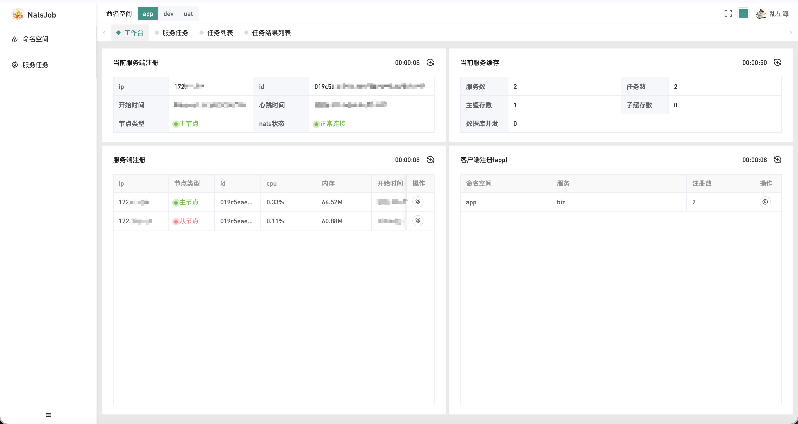
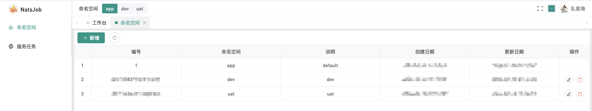
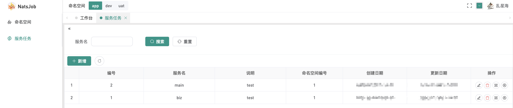
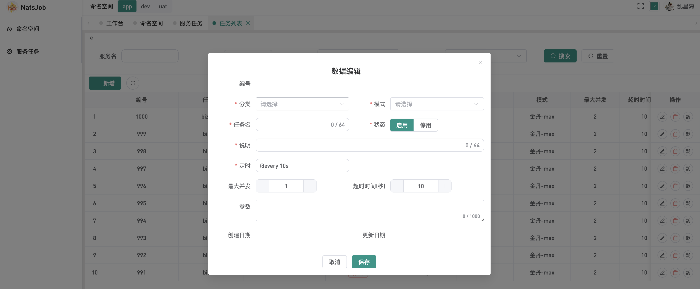

# 界面使用说明

## 首页

- **命名空间**：页面顶部提供命名空间切换功能，不同命名空间下的服务任务数据完全隔离，互不影响。
- **当前服务端注册**：展示当前所选中命名空间下服务的实时状态信息。
- **当前服务缓存**：展示当前服务运行中的任务数量及缓存数据量统计（仅master节点展示实际数值，非master节点默认显示0）。
- **服务端注册**：列表展示已注册的多个natsjob服务端的详细信息。
- **客户端注册**：展示当前命名空间下工作节点的注册心跳状态及相关信息。

## 命名空间管理

- **核心功能**：支持命名空间的创建、管理操作；每个命名空间作为独立的资源隔离单元，其下的所有服务任务数据完全隔离。

## 服务任务管理

- **服务任务创建**：支持创建唯一命名的服务任务（示例：biz、biz-service），任务名称需保证全局唯一性。

### 服务下的定时任务

- **定时任务创建**：针对已创建的服务，可配置具体的定时任务，核心配置项说明如下：
    - **任务分类**：支持三种类型——单机任务、广播任务、map任务。
    - **运行模式**：包含五个等级——炼气-lite、筑基-plus、金丹-max、元婴-pro、道祖-ultra。
    - **任务名称**：自定义任务标识（示例：clear-log（清理日志）、clear-cache（清理缓存）），需清晰体现任务用途。
    - **状态**：启用：任务生效；停用：任务不生效。
    - **任务说明**：填写任务的详细描述信息，便于后续维护。
    - **最大并发数**：仅max、pro、ultra模式支持该配置；在任务超时时间范围内，若并发执行数达到该上限，新任务将暂停下发。建议默认设置为1，任务会在客户端执行完成或超时后结束；若设置大于1，任务同样遵循“客户端执行完成/超时结束”的规则。
    - **超时时间**：设置任务的最大执行超时阈值，超时后任务将强制结束。
    - **自定义参数**：支持配置任务执行所需的自定义参数，参数会随任务下发至客户端并在执行过程中生效。

